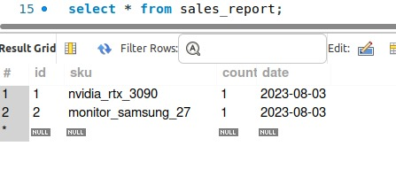

<h1 align="center">nicoomarquez/challenge-docker-magento</h1>

<div align="center">
  <p>This repository is a fork of https://github.com/markshust/docker-magento#markshustdocker-magento</p>
</div>

## Table of contents
- [Usage](#usage)
- [Prerequisites](#prerequisites)
- [Setup](#setup)
- [Testing](#testing)
- [Useful commands](#useful-commands)
- [Credits](#credits)
- [License](#license)

## Usage

This configuration is intended to be used as a Docker-based development environment for Magento 2.

Folders:

- `images`: Docker images for nginx and php
- `compose`: sample setups with Docker Compose


## Prerequisites

This setup assumes you are running Docker on a computer with at least 6GB of RAM allocated to Docker, a dual-core, and an SSD hard drive. [Download & Install Docker Desktop](https://www.docker.com/products/docker-desktop).

This configuration has been tested on Linux.

## Setup

### Before install
Make sure that local services are not blocking the required ports to setup this project.

For example: `sudo systemctl stop mysql apache2 elasticsearch`

- `node`: 3000

- `nginx`: 80

- `phpmyadmin`: 443, 8080

- `mailcatcher`: 1080

- `mariadb`: 3306

- `rabbitmq`: 15672, 5672

- `redis`: 6379

- `Opensearch`: 9200, 9300


### Automated Setup (New Project)

```bash
# Create your project directory then go into it:
mkdir challenge
cd challenge

# Run this automated one-liner from the directory you want to install the project.
curl -s https://raw.githubusercontent.com/nicoomarquez/challenge-docker-magento/master/lib/onelinesetup | bash -s -- magento.test 2.4.6 community
```

The `magento.test` above defines the hostname to use, and the `2.4.6` defines the Magento version to install. Note that since we need a write to `/etc/hosts` for DNS resolution, you will be prompted for your system password during setup.

After the one-liner above completes running, you should be able to access your site at `https://magento.test`.

### Authentication with repo.magento.com
It's posible that during the installation, Magento public/private keys need to be entered.
Feel free to use these credentials to setup the project:

- `public`: 887b9bfec9db5a9b35eb3e381cbc7c92
- `private`: 1d40a94537c5e2ca9b6379e173b3d981

## Testing

### Provider API Service
On Postman or a web browser, you can access `http://localhost:3000/getAllSkuOffers/nvidia_rtx_3090` and `http://localhost:3000/getAllSkuOffers/monitor_samsung_27` to check the configured offers for both products created in the store.

### Magento API Service
On Postman or a web browser, you can access `https://magento.test/rest/V1/offers/getBestOffer/nvidia_rtx_3090` and `https://magento.test/rest/V1/offers/getBestOffer/monitor_samsung_27` to check the best offers available for the giving product. The result depends on the criterial selector configured in the admin. 

Here is an example of the response of this service
```JSON
{
    "id": 8,
    "price": 770,
    "stock": 10,
    "shipping_price": 10,
    "delivery_date": "2023-08-15",
    "can_be_refunded": false,
    "status": "new",
    "guarantee": false,
    "seller": {
        "name": "Seller 3",
        "qualification": 10,
        "reviews_quantity": 1000
    }
}
```

### Daily sales report command
Due to Docker environment configurations, crons might not work as expected. Additionally, if there are no orders from the previous day created at the moment of execution, this process will not generate any entries. To address this gap, a command has been created to simulate a cron execution of this process, which will process the orders of the current day. To do this, you can run the following command:
- `bin/magento daily:report:command`

After running this process, you can check the `sales_report` table, which is created to keep a registry of these sales.


## Useful commands
- `bin/magento`: Run the Magento CLI. Ex: `bin/magento cache:flush`
- `bin/bash`: Drop into the bash prompt of your Docker container. The `phpfpm` container should be mainly used to access the filesystem within Docker.
- `bin/start`: Start all containers, good practice to use this instead of `docker-compose up -d`, as it may contain additional helpers.
- `bin/stop`: Stop all project containers.
- `bin/restart`: Stop and then start all containers.
- `bin/removeall`: Remove all containers, networks, volumes, and images, calling `bin/stopall` before doing so.

For more details about the commands that this repository provides, feel free to check the original repository at https://github.com/markshust/docker-magento#custom-cli-commands

## Credits

### Mark Shust's docker-magento repository
https://github.com/markshust/docker-magento#markshustdocker-magento

## License

[MIT](https://opensource.org/licenses/MIT)
